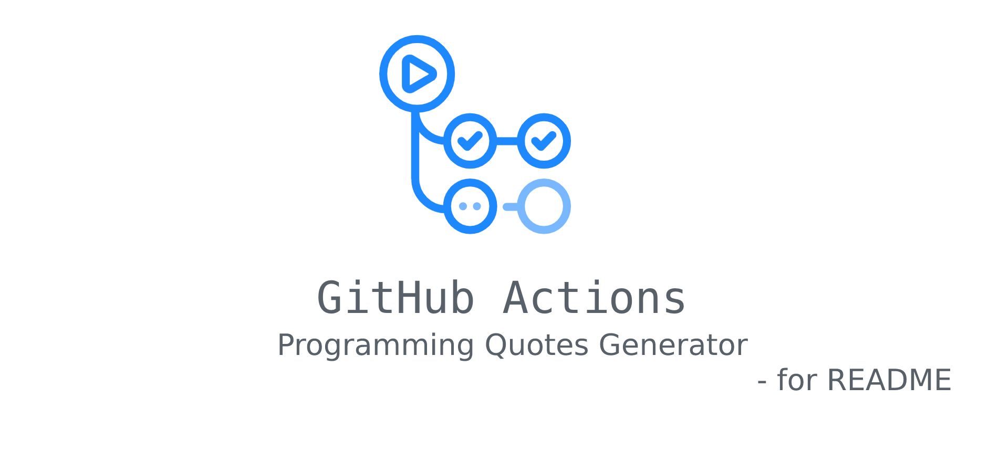

 

# Description

this workflow will update your README with a programming quote every day. 
static_template should be the original README .  

# How it works?

the script will generate a quote for you then he will create a new README using the static one plus the quote.
***

quote of the day :
The computer is not just an advanced calculator or camera or paintbrush; rather, it is a device that accelerates and extends our processes of thought. -Danny Hillis
